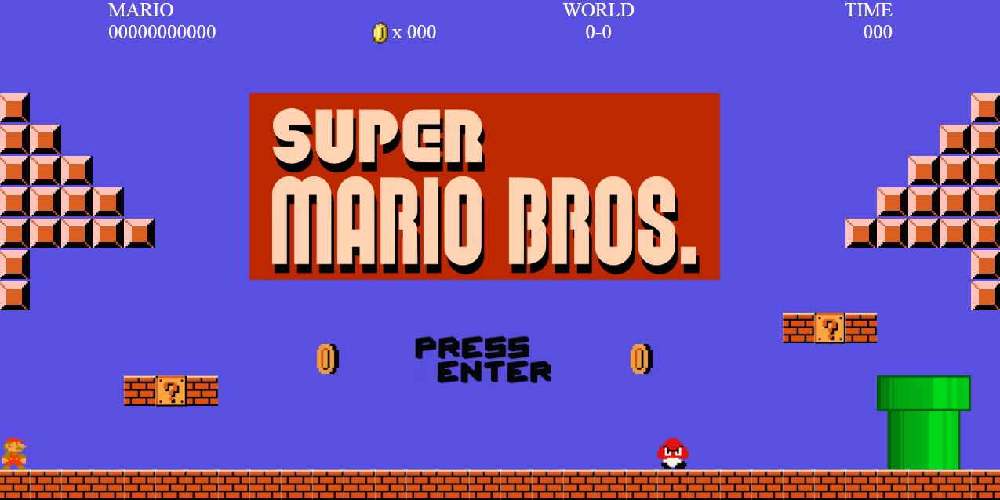

# Super-Mario

## The Project Name:
### Super Mario

## Project Description:
Based on the popular Super Mario Brothers Game. You are Mario and you need to make your way through the levels avoding the bad guys to save the princess. Along the way, you can pick up coins for extra points, destory bricks and jump for the flag. But be careful, a big boss may be waiting for you at the end of each world

## Requirements:
Internet Browser (Chrome, Firefox, Safari, Etc...)

## Author:
Sean Waszkiewicz

## Technologies Used:
Javascript

## Installation Instructions: 
No additional resources needed

## Unsolved Problems:
Fluidity 
Responsiveness

## Future Enhancements
Additional Enemies, bonues, levels, etc...
Level Editor

## Deployment: 
https://pages.git.generalassemb.ly/seanwas/Super-Mario/

